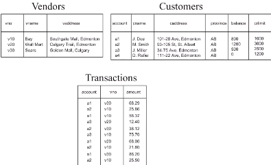
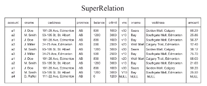

# Normalization

## Context

---

- What is wrong with the design of super relation ?
  - ***Redundancy*** is primary issue.
  - Insertion anomaly
    - Suppose insert a new customer, what is value for vendor and other fields ?
    - Many NULL value but it's an issue for SQL
  - Deletion anomaly
    - Suppose delete a vendor
      - Need to set the corresponding field of the related row to NULL
  - Update anomaly
    - Suppose a vendor's address change and that vendor has thousands of transaction with different customers
    - room for inconsistency, some rows might not be updated

---

## Guidelines

---

- Information repetition should be avoided
  - Anomalies : insertion, deletion,modification
- Avoid null values as much as possible
  - Difficulties with interpretation
    - can be don't know, don't care, etc.
  - Specification of joins
- General Solution : ***Normalization***

---

## Normal Form

---

- All relations seen in CMPUT 291 are in 1NF
  - all columns are atomic, which mean that they do not take set value
- Less redundancy, use higher order of normal form

- Two particular : 3NF and BCNF 

---

### Basic Concepts

---

- Functional dependency $X\to Y$ holds over relation $R$
  - Example : Students(sid, name, address)
  - FDs : {sid $\to$ name, sid $\to$ address}
- Implication on the key relation
  - key => unique and minimal
  - Example, sid is unique (cannot appear more than once)
- Notice that this is not 1 to 1 relationship
  - $X\to Y$ does not mean $Y\to X$
  - same name does not mean the same sid
- $X$ can be a set of attributes 
  - Example, FD : {$AB\to CDE$}
  - $X$ = $AB$
