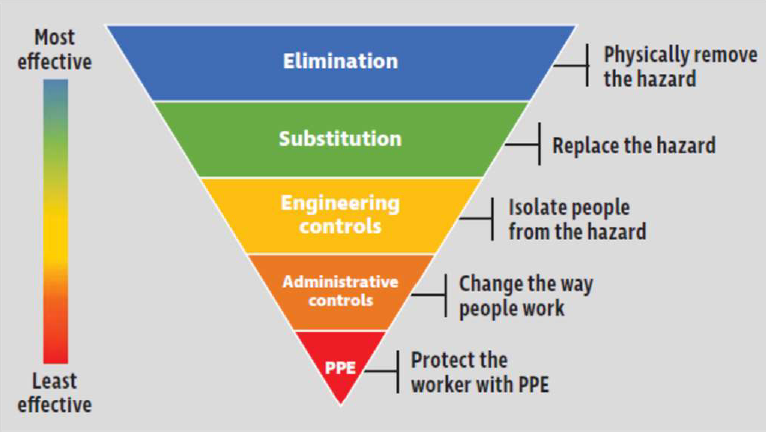
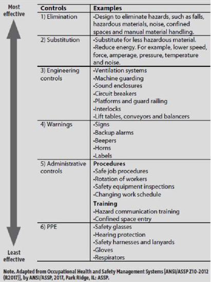

# Chapter 5

## Introduction to Tools to Reduce Risk  for Risk Management

---

### Goals

---

- ***Tools*** for leadership in risk management and their purposes
  - CCOHS Job Safety Analysis Model
  - Checklists for Executing Work
  - Multi-layered Approach to Hazard / Risk Assessment
  - Reporting and Correcting Sub-standard Conditions and At-Risk Behaviours (Sub-standard Practices)
  - Job Observations and Planned Inspections
  - Field Level Risk Assessment
  - Semi-Quantitative Risk Assessment
  - Job Observations and Planned Inspections (Audits)

- Resolve risk concerns by applying a ***risk reduction hierarchy***
- How to ask ***open-ended questions***

---

### Risk Reduction Tools

---

- Basic approach
  - “What are you doing?” (Activity)
  - “What can go wrong?” (Hazards and Risks)
  - “What are you going to do about it?” (Control Measures)
- Detailed Approach
  - Any risk assessment methodology answers these questions in order to identify control measure to reduce risk to an acceptable level :
    - What are you doing? (Activity)
    - What could go wrong? (Hazard)
    - How bad could it be? (Consequence)
    - How likely is it to happen? (Likelihood)
    - Is it acceptable? (Risk)
    - What can I do about it? (Controls – Admin or Eng’g)
    - How does the control change the L and C? (Reduce, remain unchanged, or increase?)

---

#### Example

---

- Activity : *cooking noodle soup for lunch* and it needs to be done carefully to *prevent burning yourself*
- Key activity: holding pot of boiling soup
- Hazard or risk: hot handle, burn hand on hot handle
- Control measure: use a pot holder or oven mitt.

---

### Asking Open-ended Questions

---

- “Help me understand the work you are doing and its hazards.”

- “Can you explain to me **how** your work **is done**, and how to **improve** it?”

- “Can you tell me about the hazards and safeguard that are **associated** with your **work**?”

- Why asking these questions ?
  - Demonstrates management commitment and leadership (#1 MLCA)
  - Coach in a visible and effective manner (supportive, not adversarial, not confrontational).

  

---

## The Fundamental Approach to Control All Risks

---

### Goals

---

- Two different approaches for a Risk Reduction Hierarchy
  - AB OH&S Code Part 2 Hazard Assessment, Elimination, and Control
  - ANSI Z10-2012: Risk Reduction Hierarchy & Hierarchy of Effectiveness
- Apply the two different approaches to **identify, evaluate, and select** the most effective risk reduction solution(s).
  - the most effective safeguard / control measure

- Order of effectiveness is ***not*** an order of priority.

---

### AB OH&S Code Part 2

---

- The **AB OH&S Code Part 2 Section 9** specifies the **order of effectiveness**, a basic approach of a Risk Reduction Hierarchy:
  1. Eliminate
  2. Apply Engineering Controls to Reduce the Exposure
  3. Apply Administrative Controls and Work Practices to Reduce the Exposure
  4. Use PPE
  5. Use combinations of above.

---

### ANSI Z10-2012: Risk Reduction Hierarchy & Hierarchy of Effectiveness

---

- Has same order as AB OH&S but includes *substitution*

  

- ***Order of effectiveness*** $\neq$ ***Priority***

  - One prioritize PPE because it's easy and cheap but it is not th e

- It can be combinations of them

  - Apply engineering controls - encompasses substitute, isolate / separate, engineer
  - Apply admin controls - organization an procedures (policy for when one need to wear PPE)
  - PPE - work practices

  

---

#### Example

---

- Potentially tie in Fernie example with regard to engineering controls (substitute, isolate, engineer)
- Replace the brine with ethylene glycol (antifreeze)
  - substitute, or replace the ammonia with Freon
- Use a more corrosion resistant heat exchanger (shelled tube?)

---

## Field Level Risk Assessment (FLRA)

---

### Goal

---

- Purpose of the Field-Level Risk Assessment (FLRA) Tool
  - a Risk Management tool
- The manner in which FLRA is used
- The benefits for planning work using the FLRA
- Applying FLRA as a rudimentary skill of leadership...

---

### Recall

---

- The Discovery Model
- Fundamental Approach
