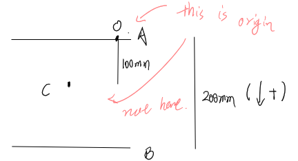

# Continuous Motion

## Problem Solving

---

- Read the problem and try to **correlate** the **actual physical situation** with the **theory**
- Draw any necessary diagrams and tabulate the problem data
- Establish a **coordinate system** and apply the **relevant principles**
- Solve the necessary equations algebraically as far **as practical**
  - use a consistent set of units and complete the solution numerically.
- Study the answer using **technical judgement** and **common sense** to determine whether or not it seems reasonable.
- Review the problem. Try to think of **other ways** of obtaining the same solution

---

### Remark

---

- When a particle is released at some point A but distance measure is not started from A instead of another point B (aka, origin)

- Use B as origin,  setting A as the new origin will produce the incorrect result

  

---

## Rectilinear Kinematics : Continuous Motion

---

- *Position is a vector quantity*, $\vec{s}$ 
  - **position coordinate**, s
  - magnitude of s is the distance from O to the particle (in m or ft)
- *Displacement is a vector quantity*, $\vec{\Delta s}$
  - Distance traveled is *a positive scalar*
    - total length of path over which the particle travels.
- The *magnitude* of the velocity is **speed** (in m/s or ft/s)
  - Term **average speed** is used occasionally
    - a positive scalar

---

### Acceleration

---

- When the particle is *slowing down* (speed is decreasing)
  - **decelerating**
  - $\Delta v = v' - v < 0$
  - $a$ will also be negative $\rightarrow$  act in the opposite sense to $v$
- If the particle is originally at rest, then it can have an acceleration
  - if a moment later it has a velocity $v'$
- If *velocity is constant*, then *acceleration is zero*

---